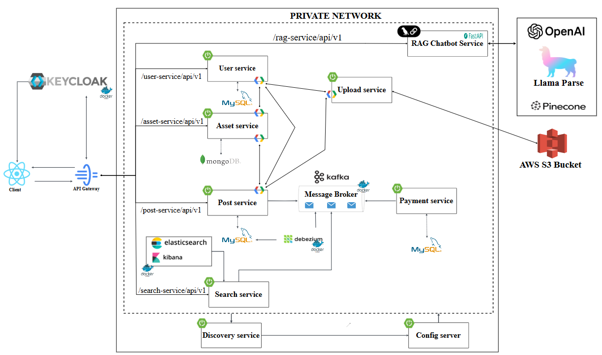

# TLand-Backend

## Introduction

**TLand-Backend** is the backend source code for a real estate website system developed based on a microservice architecture. This project aims to optimize the process of searching, buying, and renting real estate by leveraging modern technologies such as Spring Boot, Spring Cloud (with Eureka), gRPC, RAG chatbot (AI), Kafka, Elasticsearch, Keycloak, and integrating VNPAY for online payments.

### Features
- Easily and securely post and manage their real estate assets.
- Publish listings for sale or rent whenever needed.
- Quickly and accurately search for properties based on details, amenities, location, and other criteria.
- Receive advice from a virtual assistant to make informed decisions and get loan package recommendations.
- Administrators can approve listings and supplement data to enhance the capabilities of the virtual assistant.

## Architecture & Technologies Used

- **Microservice Architecture**: The system is divided into small, independent services, making it easy to scale and maintain.
- **Spring Boot & Spring Cloud (Eureka)**: Core frameworks for building and orchestrating microservices in Java, with Eureka for service discovery.
- **gRPC**: Efficient communication between services, supporting fast data transfer.
- **RAG Chatbot (AI)**: Virtual assistant helps users search and consult on real estate and financial loans.
- **Kafka**: Message queue system for handling asynchronous tasks and service communication.
- **Elasticsearch**: Provides powerful search capabilities across multiple criteria (details, amenities, location, etc.).
- **Keycloak**: Open-source identity and access management for authentication and authorization.
- **VNPAY**: Integrated payment gateway supporting secure online transactions for real estate deals.

## Installation Guide

### System Requirements

- Docker or an environment to deploy separate microservices.
- Kafka, Elasticsearch, Keycloak, Eureka, and VNPAY connectivity.
- Environment variables for database connections, message queue, AI model, etc.

### Installation Steps

1. Clone the repository:
   ```bash
   git clone https://github.com/tanle9t2/TLand-Backend.git
   ```
2. Install supporting services: Kafka, Elasticsearch, Keycloak, Eureka following their respective guides.
3. Configure environment variables in the `.env` file.


## Contributing

Please create a pull request or contact the repo administrator to contribute or report issues.

## License

This project is licensed under the MIT License.

---

**Contact:** [tanle9t2](https://github.com/tanle9t2)
